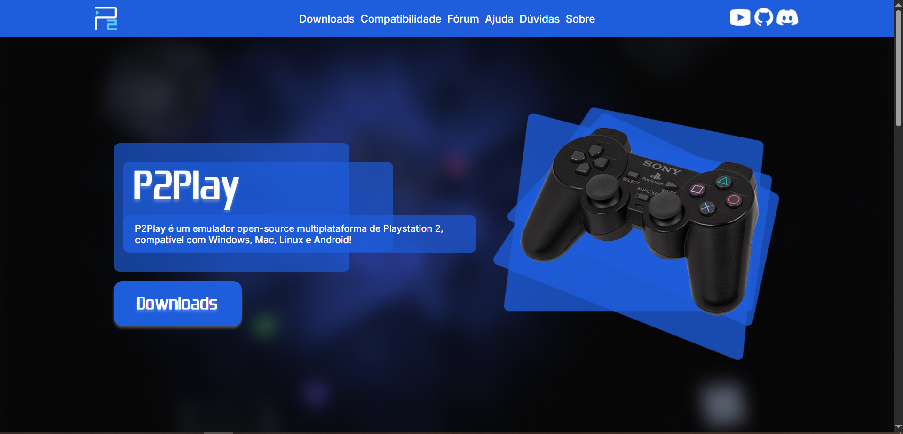

# 🎮 P2Play - Site de um Emulador de PS2
Projeto desenvolvido na disciplina de Design Web e Arquitetura da Informação no segundo ano do curso técnico integrado de Informática para Internet da instituição IFRN / CNAT.

## Sobre o projeto
O projeto é o site do P2Play, emulador fictício de PlayStation2 (PS2).

Ao decorrer do desenvolvimento do projeto, aprimorei minhas habilidades em:
- Planejamento de projeto, organizando as ideias e definindo etapas de execução
- Prototipação, criando modelos interativos e visuais para guiar a construção do site.
- Design visual, criando e implementando imagens personalizadas para o site, trabalhando com layout, identidade visual e experiência do usuário.
- Desenvolvimento front-end, utilizando HTML5, CSS3 e JavaScript para construir a estrutura, o estilo e a interatividade do site.

## Como visualizar o projeto?
Para visualizar o projeto, apenas baixe o repositório e abra o arquivo index.html no seu browser. Pronto!

## 📝 Observações

- Este projeto é apenas educacional e não disponibiliza ROMs ou softwares protegidos por direitos autorais.
- A marca **P2Play** é fictícia e criada apenas para fins acadêmicos.

## 📸 Prévia

